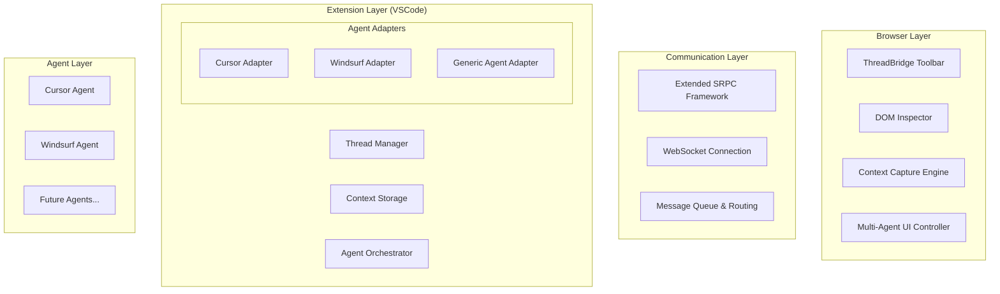

# Product Requirements Document: ThreadBridge
**Multi-Agent Frontend für Cursor und Windsurf**

---

## Document Information
- **Version**: 1.0
- **Date**: 04.01.2025
- **Author**: ThreadBridge Development Team
- **Status**: Draft
- **Review Date**: TBD

---

## Executive Summary

### Product Vision
ThreadBridge ist ein innovatives Frontend-Tool, das als gemeinsame Brücke zwischen Web-Anwendungen und den KI-Code-Agenten Cursor und Windsurf fungiert. Das Tool ermöglicht es Entwicklern, beide Agenten in einem gemeinsamen Thread zusammenarbeiten zu lassen und dabei denselben Kontext (DOM-Elemente, Screenshots, Kommentare) zu teilen.

### Value Proposition
**"Ein Klick, zwei Agenten, ein Thread"** - ThreadBridge eliminiert die Reibung bei der Multi-Agent-Kollaboration durch automatisierte Kontext-Synchronisation und gemeinsame Threading.

### Business Goals
1. **70% Zeitersparnis** bei Kontext-Setup für Multi-Agent-Workflows
2. **Marktführerschaft** in Multi-Agent-Development-Tools
3. **Community-Adoption** von >1000 MAU innerhalb 6 Monaten
4. **Technologievorsprung** durch einzigartige Thread-Synchronisation

---

## Problem Statement

### Das zentrale Problem
Entwickler, die mit KI-Code-Agenten wie Cursor und Windsurf arbeiten, stehen vor dem Problem der **fragmentierten Kontext-Übertragung**. Aktuell müssen sie:

1. **Manuell Kontext zwischen Agenten synchronisieren**: Screenshots machen, Code kopieren, Beschreibungen wiederholen
2. **Separate Workflows für jeden Agenten**: Verschiedene Tools und Interfaces für Cursor vs. Windsurf
3. **Verlust von Kontext-Kontinuität**: Agenten arbeiten isoliert ohne Wissen über die Arbeit des anderen
4. **Ineffiziente Multi-Agent-Kollaboration**: Keine Möglichkeit, beide Agenten gleichzeitig auf denselben UI-Kontext anzusetzen

### Impact Analysis
- **Zeitverlust**: 15-30 Minuten pro Task für manuelle Kontext-Übertragung
- **Qualitätsverlust**: Inkonsistente oder unvollständige Kontextinformationen
- **Frustrierter Workflow**: Unterbrochene Denkprozesse durch Tool-Wechsel
- **Untergenutztes Potenzial**: Agenten können ihre komplementären Stärken nicht ausspielen

---

## Target Users & Market Analysis

### Primary User Personas

#### Persona 1: Alex - Senior Frontend Developer
- **Role**: Lead Developer in einem SaaS-Startup
- **Context**: Arbeitet täglich mit komplexen React-Anwendungen
- **Pain Points**: 
  - Muss zwischen Cursor (für Refactoring) und Windsurf (für neue Features) wechseln
  - Verliert Zeit beim Erklären derselben UI-Probleme an beide Agenten
  - Wünscht sich kohärente Lösungsansätze von beiden Agenten
- **Goals**: Effizienter arbeiten, bessere Code-Qualität, weniger repetitive Aufgaben
- **Usage Pattern**: 4-6 Stunden täglich, komplexe Multi-Component-Tasks

#### Persona 2: Maria - Full-Stack Developer
- **Role**: Freelance Developer für verschiedene Kunden
- **Context**: Arbeitet an verschiedenen Projekten (React, Vue, Angular)
- **Pain Points**:
  - Jeder Client hat andere Präferenzen für KI-Tools
  - Muss Workflows für verschiedene Tool-Kombinationen verwalten
  - Schwierigkeiten bei der Dokumentation von AI-assistierten Entscheidungen
- **Goals**: Tool-agnostischer Workflow, bessere Client-Kommunikation
- **Usage Pattern**: 2-4 Projekte parallel, verschiedene Tech-Stacks

#### Persona 3: David - Team Lead
- **Role**: Technischer Lead in einem 8-köpfigen Entwicklungsteam
- **Context**: Koordiniert verschiedene Entwickler mit unterschiedlichen AI-Tool-Präferenzen
- **Pain Points**:
  - Team verwendet verschiedene AI-Agenten inkonsistent
  - Schwierigkeiten bei Code-Reviews von AI-generiertem Code
  - Wünscht sich standardisierte Processes für AI-Nutzung
- **Goals**: Team-weite Standards, bessere Kollaboration, nachvollziehbare AI-Entscheidungen
- **Usage Pattern**: Oversight von 5-8 Entwicklern, Strategic Decision Making

### Market Sizing
- **Total Addressable Market (TAM)**: ~2M aktive KI-unterstützte Entwickler weltweit
- **Serviceable Addressable Market (SAM)**: ~500K Cursor/Windsurf-Nutzer
- **Serviceable Obtainable Market (SOM)**: ~50K Early Adopters in ersten 12 Monaten
- **Growth Rate**: 300% YoY (basierend auf Cursor/Windsurf-Adoption)

### Competitive Analysis
| Competitor | Strength | Weakness | Differentiation |
|------------|----------|----------|-----------------|
| Stagewise | Single-Agent Integration | No Multi-Agent Support | ThreadBridge extends Stagewise |
| Native Agent UIs | Direct Integration | Isolated Workflows | Cross-Agent Consistency |
| Manual Copy-Paste | No Cost | Time-Intensive | Complete Automation |
| Custom Scripts | Customizable | High Maintenance | User-Friendly Interface |

---

## Product Requirements

### Core Functional Requirements

#### FR-1: Browser Toolbar Integration
**Priority**: Must Have  
**Description**: Integrierbare Browser-Toolbar für alle führenden Frontend-Frameworks  

**Acceptance Criteria**:
- [x] Support für React, Vue, Angular, Vanilla JS
- [x] NPM-Package Installation (`npm install @threadbridge/toolbar`)
- [x] Framework-spezifische Wrapper und Plugins
- [x] Automatische Initialisierung im Development-Mode
- [x] Responsive Design für verschiedene Bildschirmgrößen
- [x] Hot-Reload-Kompatibilität

**User Stories**:
- Als Frontend-Entwickler möchte ich ThreadBridge in meine React-App integrieren, damit ich sofort mit Multi-Agent-Development beginnen kann
- Als Vue-Entwickler möchte ich dieselbe Toolbar-Funktionalität haben, damit ich nicht Framework-spezifische Tools lernen muss

#### FR-2: DOM Element Selection & Context Capture
**Priority**: Must Have  
**Description**: Ein-Klick-Auswahl von UI-Elementen mit automatischer Kontext-Erfassung  

**Acceptance Criteria**:
- [x] Hover-Highlighting von DOM-Elementen
- [x] Click-to-Select Funktionalität
- [x] Mehrfachauswahl von Elementen (Ctrl+Click)
- [x] Automatische HTML/CSS/JavaScript-Kontext-Erfassung
- [x] Framework-spezifische Metadaten (React Props, Vue Data, etc.)
- [x] Screenshot-Erstellung des ausgewählten Bereichs
- [x] Visual Feedback für ausgewählte Elemente

**Performance Requirements**:
- DOM-Selection Response Time: <100ms
- Context Capture Time: <500ms
- Screenshot Generation: <1s
- Memory Usage: <10MB per captured context

#### FR-3: Multi-Agent Communication
**Priority**: Must Have  
**Description**: Gleichzeitige Kommunikation mit Cursor und Windsurf über einheitliche API  

**Acceptance Criteria**:
- [x] VSCode Extension als Communication Bridge
- [x] WebSocket-basierte Real-time Communication
- [x] Agent Adapter Pattern für Cursor/Windsurf
- [x] Automatic Agent Discovery und Status Monitoring
- [x] Error Handling und Circuit Breaker Pattern
- [x] Message Queuing und Retry Logic

**Technical Specifications**:
```typescript
interface AgentAdapter {
  connect(): Promise<boolean>;
  sendContext(context: Context): Promise<void>;
  sendMessage(message: string): Promise<AgentResponse>;
  onResponse(callback: (response: AgentResponse) => void): void;
  getStatus(): AgentStatus;
}
```

#### FR-4: Shared Threading System
**Priority**: Must Have  
**Description**: Gemeinsamer Thread für beide Agenten mit Synchronisation  

**Acceptance Criteria**:
- [x] Thread Creation mit Multi-Agent-Participants
- [x] Real-time Thread Updates für alle Participants
- [x] Message History mit Sender-Attribution
- [x] Context Synchronisation zwischen Agenten
- [x] Thread Persistence und Recovery
- [x] Branch/Fork Functionality für alternative Lösungswege

**Data Model**:
```typescript
interface Thread {
  id: string;
  name: string;
  participants: ('user' | 'cursor' | 'windsurf')[];
  messages: Message[];
  context: Context;
  created_at: Date;
  updated_at: Date;
}
```

#### FR-5: Agent Orchestration & Routing
**Priority**: Must Have  
**Description**: Flexible Steuerung welche Agenten für welche Tasks verwendet werden  

**Acceptance Criteria**:
- [x] Agent Selection UI (Single, Multiple, All)
- [x] Task-specific Agent Recommendations
- [x] Parallel vs. Sequential Agent Execution
- [x] Agent Response Aggregation und Comparison
- [x] Manual Agent Override und Control
- [x] Agent Performance Metrics und Analytics

#### FR-6: Context Management & Versioning
**Priority**: Must Have  
**Description**: Verwaltung und Versionierung von Kontext-Daten  

**Acceptance Criteria**:
- [x] Automatic Context Versioning
- [x] Context Diff Visualization
- [x] Rollback zu Previous Context Versions
- [x] Context Export/Import (JSON Format)
- [x] Context Search und Filtering
- [x] Context Tags und Categorization

### Extended Functional Requirements

#### FR-7: Advanced UI Features
**Priority**: Should Have  
**Description**: Erweiterte UI-Features für optimale User Experience  

**Acceptance Criteria**:
- [x] Split-View für Agent Response Comparison
- [x] Timeline View für Thread History
- [x] Drag & Drop für Context Elements
- [x] Customizable Layout und Themes
- [x] Keyboard Shortcuts und Quick Actions
- [x] Search und Filter Functionality

#### FR-8: Plugin & Extension System
**Priority**: Should Have  
**Description**: Erweiterbarkeit für neue Agenten und Custom Functionality  

**Acceptance Criteria**:
- [x] Plugin API für neue Agent Integrations
- [x] Custom Context Capture Strategies
- [x] Third-party UI Components
- [x] Workflow Automation Plugins
- [x] Plugin Marketplace Integration
- [x] Hot-swappable Plugin Architecture

#### FR-9: Collaboration Features
**Priority**: Could Have  
**Description**: Team-basierte Features für gemeinsame Entwicklung  

**Acceptance Criteria**:
- [x] Thread Sharing zwischen Team Members
- [x] Comment System für Thread Discussion
- [x] Role-based Access Control
- [x] Team Analytics und Reporting
- [x] Integration mit Git und Issue Tracking
- [x] Real-time Collaborative Editing

#### FR-10: AI-Enhanced Features
**Priority**: Could Have  
**Description**: KI-gestützte Features für intelligente Automatisierung  

**Acceptance Criteria**:
- [x] Smart Agent Selection basierend auf Task Type
- [x] Automatic Context Optimization
- [x] Predictive Context Suggestions
- [x] Intelligent Response Merging
- [x] Learning from User Preferences
- [x] Auto-generation von Thread Summaries

### Non-Functional Requirements

#### NFR-1: Performance
- **Response Time**: <50ms für UI-Interaktionen
- **Throughput**: >100 concurrent users pro VSCode Extension Instance
- **Scalability**: Support für Projects mit >10k DOM Elements
- **Memory Usage**: <100MB total footprint
- **CPU Usage**: <5% baseline CPU usage

#### NFR-2: Reliability
- **Uptime**: >99.9% für lokale Components
- **Error Rate**: <0.1% für successful Operations
- **Recovery Time**: <5s für Connection Recovery
- **Data Integrity**: 100% für Context und Thread Data
- **Graceful Degradation**: Single-Agent Fallback bei Multi-Agent Failures

#### NFR-3: Security
- **Data Protection**: End-to-end Encryption für sensitive Context Data
- **Authentication**: Integration mit VSCode Authentication
- **Authorization**: Role-based Access Control
- **Privacy**: No Cloud Storage of Code ohne explicit User Consent
- **Compliance**: GDPR-compliant Data Handling

#### NFR-4: Usability
- **Learning Curve**: <10 minutes bis zur produktiven Nutzung
- **Accessibility**: WCAG 2.1 AA Compliance
- **Internationalization**: Support für EN, DE, FR, ES, JP
- **Mobile Support**: Responsive Design für Tablet-Development
- **Keyboard Navigation**: Full Keyboard Accessibility

#### NFR-5: Compatibility
- **Browsers**: Chrome 100+, Firefox 100+, Safari 15+, Edge 100+
- **VSCode**: Version 1.85+
- **Node.js**: Version 18+
- **Operating Systems**: Windows 10+, macOS 12+, Ubuntu 20.04+
- **Frameworks**: React 16+, Vue 3+, Angular 12+

---

## Technical Architecture

### System Architecture Overview

ThreadBridge erweitert die bewährte Stagewise-Architektur um Multi-Agent-Fähigkeiten und Thread-Management. Das System folgt einer modularen, ereignisorientierten Architektur mit klaren Abstraktionsebenen.



### Technology Stack

#### Frontend (Browser Toolbar)
- **Framework**: Preact 10.19+ (kompatibel mit Stagewise, kleine Bundle Size)
- **State Management**: Zustand 4.4+
- **Styling**: CSS3 + PostCSS
- **Build Tool**: Vite 5+
- **Testing**: Vitest + Testing Library

#### Backend (VSCode Extension)
- **Runtime**: Node.js 18+
- **Framework**: VSCode Extension API 1.85+
- **Communication**: WebSocket (ws 8.14+)
- **Validation**: Zod 3.22+
- **Storage**: VSCode Storage API + File System

#### Communication
- **Protocol**: Extended SRPC (Stagewise RPC)
- **Transport**: WebSocket + HTTP Fallback
- **Serialization**: JSON + Zod Schema Validation
- **Security**: HMAC-SHA256 Authentication

#### Build & DevOps
- **Monorepo**: pnpm + Turborepo
- **Bundling**: esbuild (Extension) + Vite (Toolbar)
- **CI/CD**: GitHub Actions
- **Testing**: Vitest + Playwright + @vscode/test-electron

### Data Models

#### Context Schema
```typescript
interface Context {
  id: string;
  version: number;
  timestamp: Date;
  url: string;
  selectedElements: DOMElement[];
  comments: Comment[];
  screenshot?: string; // base64
  metadata: ContextMetadata;
}

interface DOMElement {
  selector: string;
  html: string;
  styles: Record<string, string>;
  framework?: FrameworkData;
}

interface FrameworkData {
  type: 'react' | 'vue' | 'angular' | 'vanilla';
  componentName?: string;
  props?: Record<string, any>;
}
```

#### Thread Schema
```typescript
interface Thread {
  id: string;
  name: string;
  participants: AgentType[];
  messages: Message[];
  contextHistory: Context[];
  created_at: Date;
  updated_at: Date;
  metadata: ThreadMetadata;
}

interface Message {
  id: string;
  threadId: string;
  sender: 'user' | 'cursor' | 'windsurf';
  content: string;
  timestamp: Date;
  contextSnapshotId?: string;
  type: 'text' | 'code' | 'image' | 'file';
}
```

### API Specifications

#### SRPC Contract Extension
```typescript
const threadBridgeContract = createBridgeContract({
  server: {
    // Thread Management
    createThread: {
      request: z.object({
        name: z.string(),
        participants: z.array(z.enum(['cursor', 'windsurf'])),
        context: ContextSchema
      }),
      response: z.object({
        threadId: z.string(),
        success: z.boolean()
      })
    },
    
    sendToThread: {
      request: z.object({
        threadId: z.string(),
        message: z.string(),
        targetAgents: z.array(z.enum(['cursor', 'windsurf', 'all'])).optional()
      }),
      response: z.object({
        messageId: z.string(),
        timestamp: z.date()
      })
    },
    
    syncContext: {
      request: z.object({
        threadId: z.string(),
        context: ContextSchema
      }),
      response: z.object({
        syncedAgents: z.array(z.string()),
        errors: z.array(z.string()).optional()
      })
    }
  }
});
```

---

## Success Metrics & KPIs

### User Experience Metrics
| Metric | Target | Measurement Method |
|--------|--------|-------------------|
| Time to Context | <5 seconds | Performance monitoring |
| Task Completion Rate | >95% | User analytics |
| User Satisfaction | >4.5/5 stars | User surveys |
| Learning Curve | <10 minutes | Onboarding analytics |
| Error Rate | <1% | Error tracking |

### Business Metrics
| Metric | Target | Timeline |
|--------|--------|----------|
| Monthly Active Users (MAU) | 1,000 | 6 months |
| User Retention Rate | >80% | Monthly |
| Time Savings per User | 70% | Ongoing |
| Community Contributions | >50 | 12 months |
| Extension Downloads | 10,000 | 12 months |

### Technical Metrics
| Metric | Target | Monitoring |
|--------|--------|------------|
| API Response Time | <50ms | Real-time |
| Extension Startup Time | <1s | Performance logs |
| Memory Usage | <100MB | Resource monitoring |
| Thread Sync Success Rate | >99% | System metrics |
| Agent Connection Uptime | >99.9% | Health checks |

---

## Development Roadmap

### Phase 1: Foundation (Monate 1-2)
**Goals**: Grundlegende Architektur und Core Components

#### Sprint 1: Foundation Setup ✅
- Memory Bank Setup
- Technical Architecture Design
- Repository Structure
- Development Environment

#### Sprint 2: Core Components (Woche 1-2)
- Browser Toolbar Foundation
- VSCode Extension Scaffold
- Basic SRPC Communication
- DOM Element Selection

#### Sprint 3: Agent Integration (Woche 3-4)
- Cursor Adapter Implementation
- Windsurf Adapter Implementation
- Agent Status Monitoring
- Basic Error Handling

### Phase 2: Core Features (Monate 3-4)
**Goals**: Thread Management und Context Synchronisation

#### Sprint 4: Thread System (Woche 5-6)
- Thread Creation und Management
- Message System
- Thread Persistence
- Basic UI Components

#### Sprint 5: Context Management (Woche 7-8)
- Context Capture Engine
- Context Versioning
- Screenshot Integration
- Context Synchronisation

### Phase 3: Advanced Features (Monate 5-6)
**Goals**: Multi-Agent Workflows und User Experience

#### Sprint 6: Multi-Agent Features (Woche 9-10)
- Agent Orchestration
- Parallel Agent Execution
- Response Comparison
- Agent Analytics

#### Sprint 7: UI/UX Enhancement (Woche 11-12)
- Advanced UI Components
- Split View Implementation
- Timeline View
- Customizable Layouts

### Phase 4: Polish & Release (Monate 7-8)
**Goals**: Testing, Documentation und Release

#### Sprint 8: Testing & QA (Woche 13-14)
- Comprehensive Test Suite
- Performance Optimization
- Cross-browser Testing
- Load Testing

#### Sprint 9: Documentation & Release (Woche 15-16)
- User Documentation
- API Documentation
- Release Preparation
- Community Launch

---

## Risk Assessment & Mitigation

### High Priority Risks

#### Risk 1: API Dependencies
**Description**: Cursor/Windsurf APIs können sich jederzeit ändern  
**Impact**: High (System-breaking)  
**Probability**: Medium  
**Mitigation**:
- Adapter Pattern für API Abstraktion
- Comprehensive API Monitoring
- Fallback Mechanisms
- Community Partnership für Early API Access

#### Risk 2: Performance at Scale
**Description**: Thread-Synchronisation könnte bei komplexen Apps langsam werden  
**Impact**: Medium (User Experience)  
**Probability**: Medium  
**Mitigation**:
- Lazy Loading Strategy
- Efficient Caching Mechanisms
- Performance Monitoring
- Progressive Enhancement

#### Risk 3: User Adoption Complexity
**Description**: Multi-Agent-Workflow könnte zu komplex für Nutzer sein  
**Impact**: High (Product Success)  
**Probability**: Low  
**Mitigation**:
- Progressive Disclosure UI Design
- Comprehensive Onboarding
- Intelligent Defaults
- User Testing at each Phase

### Medium Priority Risks

#### Risk 4: Technical Debt from Stagewise Base
**Description**: Building on Stagewise könnte zu Technical Debt führen  
**Impact**: Medium (Development Velocity)  
**Probability**: Medium  
**Mitigation**:
- Clean Extension Strategy
- Regular Refactoring Sprints
- Comprehensive Testing
- Documentation of Design Decisions

#### Risk 5: Resource Constraints
**Description**: 2-4 Entwickler für 8-Monats-Projekt könnte knapp sein  
**Impact**: Medium (Timeline)  
**Probability**: Medium  
**Mitigation**:
- Agile Development Process
- Community Contributions
- Scope Prioritization
- Automated Testing and CI/CD

---

## Compliance & Governance

### Open Source Strategy
- **License**: MIT License (kompatibel mit Stagewise)
- **Repository**: Public GitHub Repository
- **Contribution Guidelines**: Standard Open Source Process
- **Code of Conduct**: Contributor Covenant
- **Security Policy**: Responsible Disclosure Process

### Privacy & Data Protection
- **Data Minimization**: Nur notwendige Daten erfassen
- **Local Storage**: Primär lokale Datenspeicherung
- **User Consent**: Explicit Opt-in für Cloud Features
- **Data Portability**: JSON Export/Import Functionality
- **GDPR Compliance**: EU-konforme Datenverarbeitung

### Quality Assurance
- **Code Quality**: ESLint + Prettier + SonarQube
- **Test Coverage**: >90% für Core Components
- **Security Scanning**: Automated Dependency Scanning
- **Performance Monitoring**: Real-time Performance Metrics
- **User Feedback**: Built-in Feedback Mechanisms

---

## Appendix

### Glossary
- **Agent**: KI-Code-Assistant (Cursor oder Windsurf)
- **Context**: Erfasste Informationen über DOM-Elemente und UI-State
- **Thread**: Gemeinsamer Kommunikationskanal zwischen User und Agenten
- **SRPC**: Stagewise RPC - Type-safe Remote Procedure Call Framework
- **Adapter**: Software Pattern für Agent-spezifische API-Abstraktion

### References
- [Stagewise Documentation](https://stagewise.io/docs)
- [VSCode Extension API](https://code.visualstudio.com/api)
- [Model Context Protocol (MCP)](https://spec.modelcontextprotocol.io/)
- [Preact Documentation](https://preactjs.com/)
- [Turborepo Documentation](https://turbo.build/)

### Change Log
| Version | Date | Changes | Author |
|---------|------|---------|--------|
| 1.0 | 04.01.2025 | Initial PRD Creation | ThreadBridge Team |

---

**Document Status**: Draft - Ready for Review  
**Next Review**: TBD  
**Approvers**: Product Owner, Technical Lead, Stakeholders
