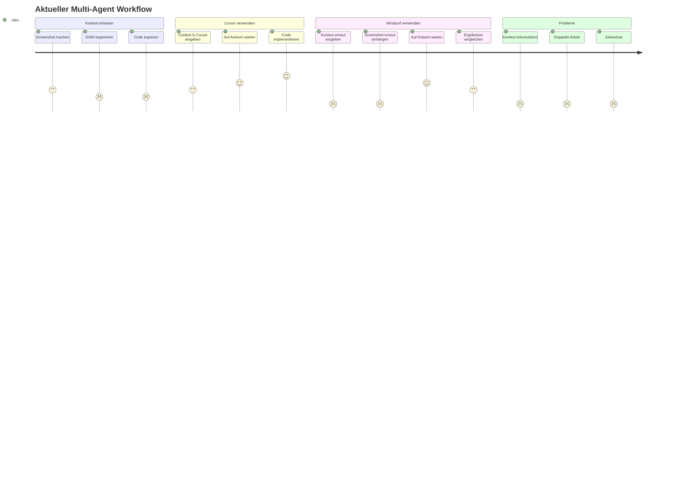
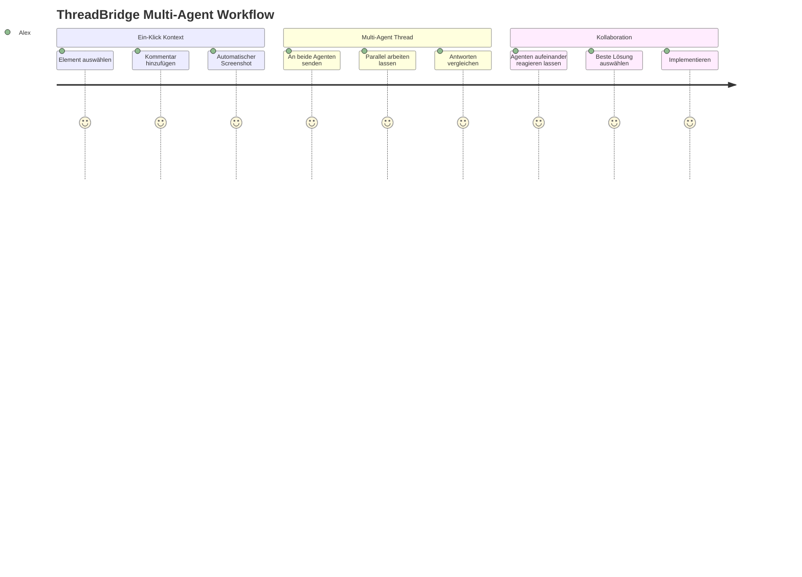

# Product Context: ThreadBridge

## Problembeschreibung

### Das zentrale Problem
Entwickler, die mit KI-Code-Agenten wie Cursor und Windsurf arbeiten, stehen vor dem Problem der **fragmentierten Kontext-Übertragung**. Aktuell müssen sie:

1. **Manuell Kontext zwischen Agenten synchronisieren**: Screenshots machen, Code kopieren, Beschreibungen wiederholen
2. **Separate Workflows für jeden Agenten**: Verschiedene Tools und Interfaces für Cursor vs. Windsurf
3. **Verlust von Kontext-Kontinuität**: Agenten arbeiten isoliert ohne Wissen über die Arbeit des anderen
4. **Ineffiziente Multi-Agent-Kollaboration**: Keine Möglichkeit, beide Agenten gleichzeitig auf denselben UI-Kontext anzusetzen

### Auswirkungen des Problems
- **Zeitverlust**: 15-30 Minuten pro Task für manuelle Kontext-Übertragung
- **Qualitätsverlust**: Inkonsistente oder unvollständige Kontextinformationen
- **Frustrierter Workflow**: Unterbrochene Denkprozesse durch Tool-Wechsel
- **Untergenutztes Potenzial**: Agenten können ihre komplementären Stärken nicht ausspielen

## User Personas

### Persona 1: Alex - Senior Frontend Developer
- **Rolle**: Lead Developer in einem SaaS-Startup
- **Kontext**: Arbeitet täglich mit komplexen React-Anwendungen
- **Pain Points**: 
  - Muss zwischen Cursor (für Refactoring) und Windsurf (für neue Features) wechseln
  - Verliert Zeit beim Erklären derselben UI-Probleme an beide Agenten
  - Wünscht sich kohärente Lösungsansätze von beiden Agenten
- **Ziele**: Effizienter arbeiten, bessere Code-Qualität, weniger repetitive Aufgaben

### Persona 2: Maria - Full-Stack Developer
- **Rolle**: Freelance Developer für verschiedene Kunden
- **Kontext**: Arbeitet an verschiedenen Projekten (React, Vue, Angular)
- **Pain Points**:
  - Jeder Client hat andere Präferenzen für KI-Tools
  - Muss Workflows für verschiedene Tool-Kombinationen verwalten
  - Schwierigkeiten bei der Dokumentation von AI-assistierten Entscheidungen
- **Ziele**: Tool-agnostischer Workflow, bessere Client-Kommunikation

### Persona 3: David - Team Lead
- **Rolle**: Technischer Lead in einem 8-köpfigen Entwicklungsteam
- **Kontext**: Koordiniert verschiedene Entwickler mit unterschiedlichen AI-Tool-Präferenzen
- **Pain Points**:
  - Team verwendet verschiedene AI-Agenten inkonsistent
  - Schwierigkeiten bei Code-Reviews von AI-generiertem Code
  - Wünscht sich standardisierte Processes für AI-Nutzung
- **Ziele**: Team-weite Standards, bessere Kollaboration, nachvollziehbare AI-Entscheidungen

## User Journey: Aktueller Workflow vs. Ziel-Workflow

### Aktueller Workflow (Problematisch)

### Ziel-Workflow (ThreadBridge)

## Value Proposition

### Primärer Nutzen
**"Ein Klick, zwei Agenten, ein Thread"** - ThreadBridge eliminiert die Reibung bei der Multi-Agent-Kollaboration durch automatisierte Kontext-Synchronisation und gemeinsame Threading.

### Konkrete Vorteile
1. **Zeit-Ersparnis**: 70% weniger Zeit für Kontext-Setup
2. **Bessere Ergebnisse**: Komplementäre Agenten-Stärken nutzen
3. **Konsistenz**: Identischer Kontext für alle Agenten
4. **Nachvollziehbarkeit**: Vollständige Thread-Historie
5. **Skalierbarkeit**: Workflow für zukünftige Agenten erweiterbar

## Kern-User-Stories (Epics)

### Epic 1: Unified Context Capture
**"Als Entwickler möchte ich UI-Kontext mit einem Klick erfassen und an beide Agenten senden, damit ich nicht doppelt arbeiten muss."**

### Epic 2: Shared Threading
**"Als Entwickler möchte ich beide Agenten in einem gemeinsamen Thread arbeiten lassen, damit sie voneinander lernen und sich ergänzen können."**

### Epic 3: Agent Orchestration
**"Als Entwickler möchte ich flexibel entscheiden, welche Agenten ich für welche Aufgaben einsetze, damit ich ihre jeweiligen Stärken optimal nutzen kann."**

### Epic 4: Collaborative Decision Making
**"Als Entwickler möchte ich die Vorschläge beider Agenten vergleichen und kombinieren können, damit ich die beste Lösung finde."**

## UX-Ziele

### Usability-Prinzipien
1. **Minimalismus**: Ein-Klick-Aktionen wo immer möglich
2. **Konsistenz**: Einheitliche Bedienung für alle Agenten
3. **Transparenz**: Klare Sichtbarkeit des Agenten-Status
4. **Kontrolle**: Benutzer behält Entscheidungshoheit
5. **Fehlertoleranz**: Graceful Degradation bei Agenten-Ausfällen

### Erfolgsmetriken (UX)
- **Time to Context**: <5 Sekunden für vollständige Kontext-Übertragung
- **Task Completion Rate**: >95% erfolgreiche Multi-Agent-Interaktionen
- **User Satisfaction**: >4.5/5 Sterne in Usability-Tests
- **Learning Curve**: <10 Minuten bis zur produktiven Nutzung

## Technische Herausforderungen aus UX-Sicht

### Challenge 1: Cognitive Load
**Problem**: Verwaltung von zwei Agenten könnte überfordern
**Lösung**: Intelligente Standard-Modi und progressive Disclosure

### Challenge 2: Status Confusion
**Problem**: Unklarheit über Agenten-Verfügbarkeit und -Aktivität
**Lösung**: Klare visueller Status-Indikatoren und Notifications

### Challenge 3: Result Overwhelm
**Problem**: Zu viele parallele Antworten könnten verwirren
**Lösung**: Strukturierte Vergleichsansichten und Highlighting von Unterschieden

## Marktpositionierung

### Differenzierung zu bestehenden Lösungen
- **vs. Stagewise**: Erweitert Single-Agent auf Multi-Agent-Szenarien
- **vs. Native Agent UIs**: Bietet agentenübergreifende Konsistenz
- **vs. Manual Copy-Paste**: Automatisiert kompletten Workflow
- **vs. Custom Scripts**: Benutzerfreundliche, konfigurierbare Lösung

### Zielmarkt
- **Größe**: ~2M aktive KI-unterstützte Entwickler weltweit
- **Wachstum**: 300% YoY (basierend auf Cursor/Windsurf-Adoption)
- **Bereitschaft**: Hohe Zahlungsbereitschaft für Produktivitäts-Tools
- **Early Adopters**: Open-Source-Community, Tech-Startups, Freelancer
