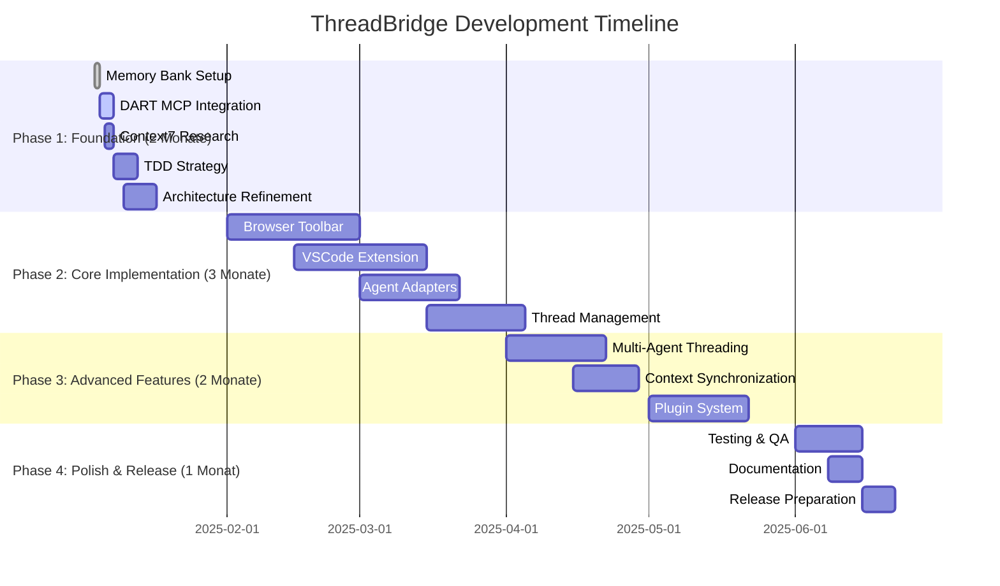

# Progress: ThreadBridge Implementation Status

## Gesamtfortschritt
**Status**: 🟢 Foundation Complete (100% Complete)  
**Aktuelle Phase**: GitHub Repository bereit für Upload  
**Nächste Phase**: Repository Creation und Team Collaboration Setup



## Implementierte Features

### ✅ Completed (100% Foundation)
- **Projektanalyse**: Vollständige Analyse aller stagewise_docs
- **Memory Bank Setup**: Alle 6 Kerndateien erstellt
  - `projectbrief.md` - Projektvision und Scope ✅
  - `productContext.md` - User Personas und UX-Ziele ✅
  - `activeContext.md` - Operatives Tagebuch ✅
  - `systemPatterns.md` - Technische Architektur ✅
  - `techContext.md` - Technology Stack ✅
  - `progress.md` - Dieses Dokument ✅
- **GitHub Repository Setup**: Vollständige Repository-Vorbereitung
  - `README.md` - Projektbeschreibung und Setup-Anleitung ✅
  - `LICENSE` - MIT Lizenz ✅
  - `CONTRIBUTING.md` - Contribution Guidelines ✅
  - `CHANGELOG.md` - Version History ✅
  - `CODE_OF_CONDUCT.md` - Community Standards ✅
  - `SECURITY.md` - Security Policy ✅
  - GitHub Issue Templates ✅
  - Pull Request Template ✅
  - CI/CD Workflow (GitHub Actions) ✅
  - SonarQube Integration ✅
  - `.gitignore` optimiert für Node.js/TypeScript ✅
- **Git Repository Initialisierung**: Lokales Repository vollständig vorbereitet
  - Initial Commit (8380ae9) mit 67 Dateien erstellt ✅
  - Projektstruktur mit 14.347 Zeilen Code/Dokumentation ✅
  - Git-Historie und -Konfiguration optimiert ✅
  - Bereit für GitHub Remote-Repository ✅

### 🔄 Currently in Development (0%)
- **GitHub Repository Creation**: Bereit für Upload
- **DART MCP Integration**: Vorbereitet für Teamarbeit
- **Context7 Research**: Community-basiert mit Contributors

### ⏳ Planned (Ready for Community)
- **Alle Core Features**: Siehe detaillierte Auflistung unten

## Aktuell in Entwicklung

### Sprint 1: Foundation Setup (04.01.2025 - 08.01.2025)
**Ziel**: Vollständige Projektinitialisierung und Tooling-Setup

#### Nächste Aufgaben (Priorität)
1. **DART MCP Integration** (Heute):
   - Projektplan aus PRD-Phasen übertragen
   - 4 Entwicklungsphasen als Epics definieren
   - Sprint-Struktur aufbauen
   - Abhängigkeiten zwischen Paketen dokumentieren

2. **Context7 MCP Research** (Heute):
   - Stagewise aktuelle Dokumentation abrufen
   - Cursor MCP API-Details recherchieren
   - Windsurf Integration-Möglichkeiten prüfen
   - VSCode Extension Best Practices sammeln

3. **Repository Initialisierung** (Morgen):
   - Monorepo-Struktur nach Stagewise-Vorbild
   - Package.json und Workspace-Konfiguration
   - TypeScript/ESLint/Prettier Setup
   - GitHub Workflow-Templates

## Backlog/Geplante Features

### Phase 1: Grundlegende Integration (2 Monate)
#### Epic 1.1: Browser Toolbar Foundation
- [ ] **Toolbar Framework Setup**: Preact/React Toolbar-Komponente
- [ ] **DOM Element Selection**: Click-to-select mit visual Highlighting
- [ ] **Context Capture Engine**: HTML/CSS/Screenshot-Erfassung
- [ ] **Comment System**: Text-Annotationen für UI-Elemente
- [ ] **Agent Selection UI**: Dropdown/Toggle für Cursor/Windsurf

#### Epic 1.2: VSCode Extension Core
- [ ] **Extension Scaffold**: Basis VSCode Extension mit SRPC-Server
- [ ] **WebSocket Communication**: Bidirektionale Toolbar-Extension-Kommunikation
- [ ] **Agent Detection**: Erkennung verfügbarer Cursor/Windsurf-Instanzen
- [ ] **Basic Agent Adapters**: Minimale Cursor und Windsurf Adapter
- [ ] **Context Storage**: Lokale Speicherung von Kontexten und Kommentaren

#### Epic 1.3: Basic Communication
- [ ] **SRPC Extension**: Erweiterte RPC-Contracts für Multi-Agent-Support
- [ ] **Message Routing**: Grundlegendes Routing zwischen Toolbar und Agenten
- [ ] **Error Handling**: Robuste Fehlerbehandlung und Fallback-Modi
- [ ] **Status Management**: Agent-Verfügbarkeit und Verbindungsstatus

### Phase 2: Gemeinsamer Thread (3 Monate)
#### Epic 2.1: Thread Management
- [ ] **Thread Creation**: Neue Threads mit mehreren Agenten erstellen
- [ ] **Thread Storage**: Persistierung und Versionierung von Threads
- [ ] **Thread Navigation**: UI für Thread-Historie und Navigation
- [ ] **Thread Metadata**: Tags, Beschreibungen, Erstellungszeit

#### Epic 2.2: Context Synchronization
- [ ] **Real-time Sync**: Live-Synchronisation von Kontext zwischen Agenten
- [ ] **Conflict Resolution**: Behandlung von widersprüchlichen Kontexten
- [ ] **Version Control**: Kontext-Versionierung und Rollback-Funktionen
- [ ] **Selective Sync**: Granulare Kontrolle über synchronisierte Daten

#### Epic 2.3: Multi-Agent Communication
- [ ] **Parallel Messaging**: Gleichzeitiges Senden an mehrere Agenten
- [ ] **Response Aggregation**: Sammlung und Darstellung von Agent-Antworten
- [ ] **Agent Orchestration**: Koordination und Reihenfolge von Agent-Aktionen
- [ ] **Cross-Agent References**: Agenten können aufeinander Bezug nehmen

### Phase 3: Erweiterte Funktionen (2 Monate)
#### Epic 3.1: Collaborative Features
- [ ] **Agent-to-Agent Communication**: Agenten können direkt miteinander interagieren
- [ ] **Task Distribution**: Automatische Aufgabenverteilung basierend auf Agent-Stärken
- [ ] **Result Merging**: Tools zum Zusammenführen von Agent-Ergebnissen
- [ ] **Feedback Loops**: Agenten können auf Vorschläge des anderen reagieren

#### Epic 3.2: Advanced UI
- [ ] **Split View**: Side-by-side Vergleich von Agent-Antworten
- [ ] **Timeline View**: Chronologische Darstellung von Thread-Aktivitäten
- [ ] **Context Visualization**: Grafische Darstellung von Kontextänderungen
- [ ] **Customizable Layout**: Benutzer-konfigurierbare UI-Layouts

#### Epic 3.3: Plugin System
- [ ] **Agent Plugin Architecture**: Framework für neue Agent-Integrationen
- [ ] **Context Plugins**: Erweiterbare Kontext-Erfassungsstrategien
- [ ] **UI Plugins**: Benutzerdefinierte UI-Komponenten und -Aktionen
- [ ] **Workflow Plugins**: Automatisierte Multi-Agent-Workflows

### Phase 4: Optimierung und Stabilisierung (1 Monat)
#### Epic 4.1: Performance Optimization
- [ ] **Bundle Size Optimization**: Minimierung der Toolbar-Bundle-Größe
- [ ] **Memory Management**: Effiziente Speichernutzung für große Kontexte
- [ ] **Caching Strategy**: Intelligentes Caching für häufig verwendete Daten
- [ ] **Connection Pooling**: Optimierte WebSocket-Verbindungen

#### Epic 4.2: Testing & QA
- [ ] **Unit Test Coverage**: >90% Coverage für alle Core-Module
- [ ] **Integration Tests**: Ende-zu-Ende Tests für Multi-Agent-Workflows
- [ ] **Performance Tests**: Lastests für große DOM-Strukturen
- [ ] **Cross-browser Testing**: Kompatibilität mit allen Ziel-Browsern

## Bekannte Fehler/Bugs

### Critical Issues
*Noch keine - Projekt in Initialization Phase*

### High Priority Issues
*Noch keine - Projekt in Initialization Phase*

### Medium Priority Issues
*Noch keine - Projekt in Initialization Phase*

### Low Priority Issues
*Noch keine - Projekt in Initialization Phase*

## Technical Debt Log

### Identified Technical Debt
*Noch keine - Clean Start geplant*

### Planned Refactoring
1. **Stagewise Dependency Analysis**: Bewertung der Abhängigkeit vs. Fork-Entscheidung
2. **API Abstraction Layer**: Vorbereitung auf sich ändernde Agent-APIs
3. **Plugin System Architecture**: Frühe Berücksichtigung für spätere Erweiterbarkeit

## Testabdeckungs-Status

### Current Coverage: 0% (No tests yet)
- **Target Coverage**: >90% für Core-Module
- **Strategy**: TDD-Ansatz ab Phase 1

### Testing Strategy by Phase
```typescript
interface TestingMilestones {
  phase1: {
    unit_tests: "Basic component and utility functions";
    integration_tests: "Toolbar-Extension communication";
    target_coverage: "70%";
  };
  
  phase2: {
    unit_tests: "Thread management and context sync";
    integration_tests: "Multi-agent workflows";
    e2e_tests: "Complete user scenarios";
    target_coverage: "85%";
  };
  
  phase3: {
    unit_tests: "Plugin system and advanced features";
    integration_tests: "Complex multi-agent scenarios";
    performance_tests: "Load and stress testing";
    target_coverage: "90%";
  };
  
  phase4: {
    regression_tests: "Comprehensive regression suite";
    cross_browser_tests: "Multi-browser compatibility";
    security_tests: "Security and privacy validation";
    target_coverage: "95%";
  };
}
```

## Metriken und KPIs

### Development Metrics
- **Lines of Code**: 0 (Baseline)
- **Test Coverage**: 0% (Target: >90%)
- **Bug Density**: 0 bugs/KLOC (Target: <1)
- **Build Success Rate**: N/A (Target: >95%)

### Performance Metrics (Targets)
- **Toolbar Load Time**: Target <2s
- **Context Capture Time**: Target <500ms
- **Agent Response Time**: Agent-dependent
- **Memory Usage**: Target <50MB total

### User Experience Metrics (Future)
- **Time to First Value**: Target <30s from installation
- **Task Completion Rate**: Target >95%
- **User Satisfaction**: Target >4.5/5 stars
- **Adoption Rate**: Target >1000 MAU within 6 months

## Nächste Schritte (Detailliert)

### Heute (05.01.2025) - Repository Launch
1. **GitHub Repository Creation** (15 min):
   - Repository auf GitHub erstellen
   - Remote Origin konfigurieren
   - Initial Push durchführen

2. **Community Setup** (30 min):
   - Repository-Settings konfigurieren
   - Branches und Protection Rules
   - Issues und Discussions aktivieren

3. **Team Collaboration** (15 min):
   - Contributors Guidelines finalisieren
   - First Issues für Community erstellen
   - Projekt-Board in GitHub Projects einrichten

### Nächste Schritte (Community-driven)
1. **Development Environment** (Contributors):
   - Monorepo mit pnpm/turborepo
   - TypeScript/ESLint/Prettier Konfiguration
   - GitHub Actions CI/CD Pipeline aktivieren

2. **First Implementation Sprint** (Community):
   - Erste User Story in Tests übersetzen
   - Test-Framework Setup (Vitest)
   - Beispiel-Test für Toolbar-Komponente

### Diese Woche (06.01.2025 - 08.01.2025)
1. **Architecture Refinement**:
   - API-Design basierend auf Context7-Research
   - Dependency-Entscheidungen (Stagewise fork vs. extend)
   - First-Party vs. Third-Party Package-Strategie

2. **First Prototype**:
   - Minimale Toolbar mit DOM-Selection
   - Basic VSCode Extension mit WebSocket
   - Proof-of-Concept für Agent-Communication

**Repository-Status**: ✅ Bereit für GitHub Upload (Foundation 100% complete)  
**Nächster Meilenstein**: Community Onboarding + First Contributors  
**Risiko-Level**: 🟢 Low (Solide Basis, umfassende Dokumentation, klarer Roadmap)

## Repository Launch Checklist

### ✅ Vorbereitet und bereit
- [x] Vollständige Projektdokumentation
- [x] Memory Bank System implementiert
- [x] GitHub Templates und Workflows
- [x] CI/CD Pipeline vorbereitet
- [x] Security und Contribution Guidelines
- [x] Lizenz und Legal Compliance
- [x] Git-Historie und Commit-Struktur
- [x] Issue Templates für Bug Reports und Feature Requests

### 📋 Nächste Schritte für GitHub
1. Repository auf GitHub erstellen (öffentlich)
2. Remote Origin hinzufügen
3. Initial Push durchführen
4. Repository-Settings konfigurieren
5. GitHub Projects Board einrichten
6. First Issues für Contributors erstellen
7. Community-Diskussionen aktivieren

**Ready for Launch**: Das Projekt ist vollständig vorbereitet für die Veröffentlichung als Open-Source-Repository auf GitHub.
