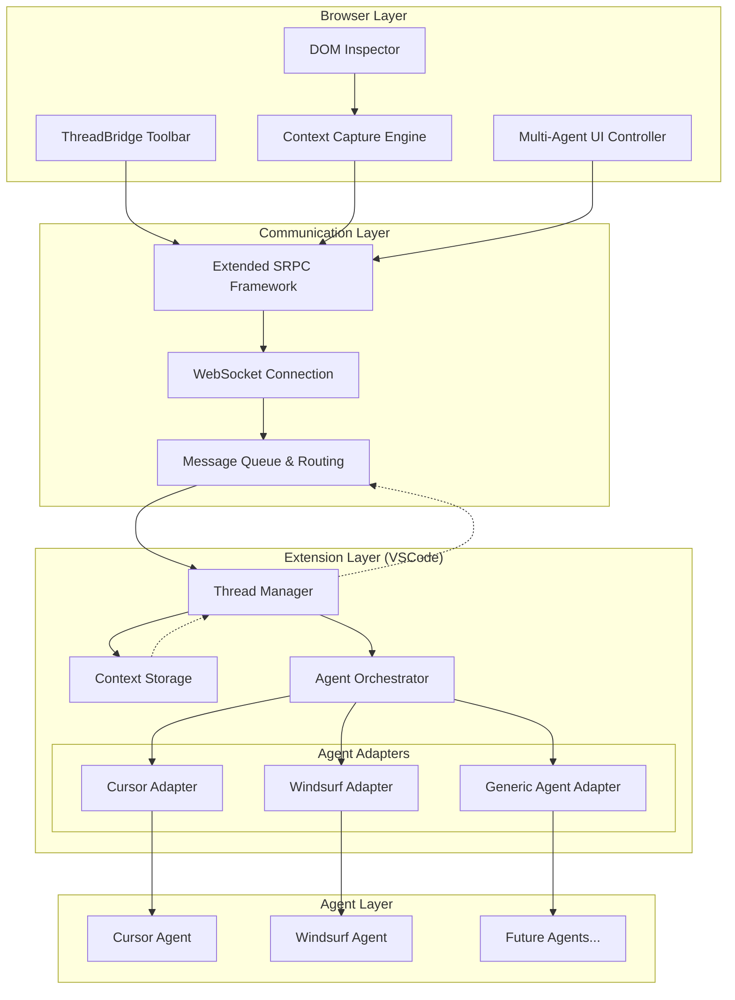
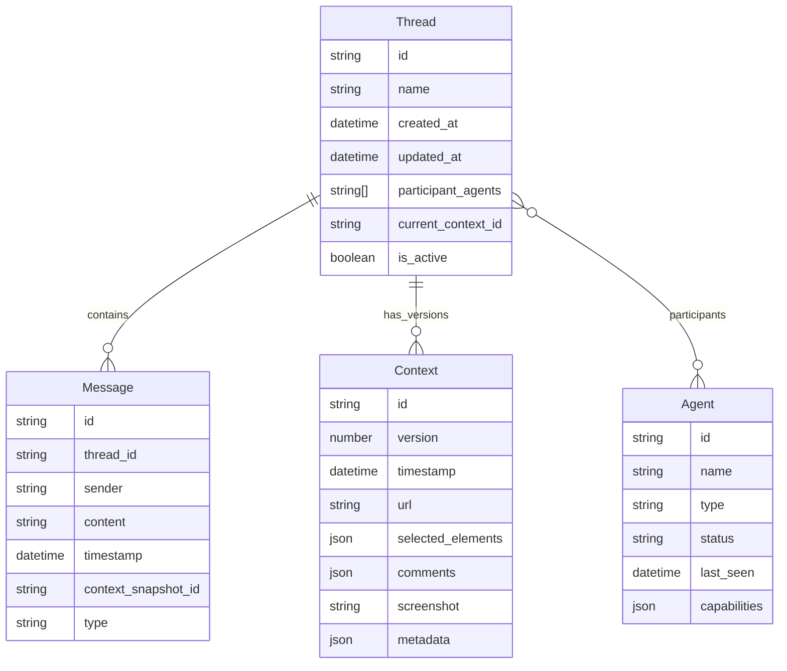

# System Patterns: ThreadBridge Architecture

## Systemarchitektur-Übersicht

ThreadBridge erweitert die bewährte Stagewise-Architektur um Multi-Agent-Fähigkeiten und Thread-Management. Das System folgt einer modularen, ereignisorientierten Architektur mit klaren Abstraktionsebenen.



## Architecture Decision Records (ADRs)

### ADR-001: Multi-Agent Communication Pattern
**Datum**: 04.01.2025  
**Status**: Proposed  
**Kontext**: Notwendigkeit einer einheitlichen Kommunikation mit verschiedenen KI-Agenten  

**Entscheidung**: Implementierung des Adapter-Patterns für Agent-spezifische Kommunikation  
- **Pro**: Saubere Abstraktion, leicht erweiterbar für neue Agenten
- **Pro**: Entkopplung von Agent-spezifischen APIs
- **Kontra**: Zusätzliche Komplexität durch Abstraktionsschicht  

**Alternativen erwogen**:
- Direct API calls (verworfen wegen fehlender Abstraktion)
- Event-sourcing (verworfen wegen Overhead)

### ADR-002: Thread Storage Strategy
**Datum**: 04.01.2025  
**Status**: Proposed  
**Kontext**: Persistierung von Thread-Daten und Kontext-Historie  

**Entscheidung**: Hybrid-Ansatz mit lokaler Primär-Speicherung und optionaler Cloud-Sync  
- **Lokal**: VSCode Workspace Storage für aktive Threads
- **Persistent**: JSON-Files im `.threadbridge/` Verzeichnis
- **Cloud**: Optional über Plugin-System  

**Begründung**: Balance zwischen Performance, Datenschutz und Verfügbarkeit

### ADR-003: SRPC Extension Strategy
**Datum**: 04.01.2025  
**Status**: Proposed  
**Kontext**: Erweiterung des bestehenden Stagewise SRPC-Frameworks  

**Entscheidung**: Backward-kompatible Erweiterung des SRPC-Contracts  
- Neue Methoden für Multi-Agent-Operationen
- Bestehende Single-Agent-Methoden bleiben unverändert
- Opt-in für ThreadBridge-Features

## Verwendete Design Patterns

### 1. Adapter Pattern (Agent Integration)
```typescript
interface AgentAdapter {
  connect(): Promise<boolean>;
  sendContext(context: Context): Promise<void>;
  sendMessage(message: string): Promise<AgentResponse>;
  onResponse(callback: (response: AgentResponse) => void): void;
  getStatus(): AgentStatus;
}

class CursorAdapter implements AgentAdapter {
  // MCP-basierte Implementierung
}

class WindsurfAdapter implements AgentAdapter {
  // API-basierte Implementierung
}
```

### 2. Observer Pattern (Thread Updates)
```typescript
class ThreadManager {
  private observers: ThreadObserver[] = [];
  
  subscribe(observer: ThreadObserver): void {
    this.observers.push(observer);
  }
  
  notify(event: ThreadEvent): void {
    this.observers.forEach(obs => obs.update(event));
  }
}
```

### 3. Strategy Pattern (Context Capture)
```typescript
interface CaptureStrategy {
  capture(element: HTMLElement): Context;
}

class ReactCaptureStrategy implements CaptureStrategy {
  capture(element: HTMLElement): Context {
    // React-spezifische Kontext-Erfassung
  }
}

class VueCaptureStrategy implements CaptureStrategy {
  capture(element: HTMLElement): Context {
    // Vue-spezifische Kontext-Erfassung
  }
}
```

### 4. Command Pattern (Agent Operations)
```typescript
interface AgentCommand {
  execute(): Promise<void>;
  undo?(): Promise<void>;
}

class SendToAllAgentsCommand implements AgentCommand {
  constructor(
    private agents: AgentAdapter[],
    private message: string,
    private context: Context
  ) {}
  
  async execute(): Promise<void> {
    // Parallel execution to all agents
  }
}
```

## Wichtige Schnittstellenbeschreibungen

### SRPC Extension Contract
```typescript
// Erweiterung des bestehenden Stagewise-Contracts
const threadBridgeContract = createBridgeContract({
  server: {
    // Bestehende Stagewise-Methoden
    triggerAgentPrompt: { /* existing */ },
    
    // Neue ThreadBridge-Methoden
    createThread: {
      request: z.object({
        name: z.string(),
        participants: z.array(z.enum(['cursor', 'windsurf'])),
        context: ContextSchema
      }),
      response: z.object({
        threadId: z.string(),
        success: z.boolean()
      })
    },
    
    sendToThread: {
      request: z.object({
        threadId: z.string(),
        message: z.string(),
        targetAgents: z.array(z.enum(['cursor', 'windsurf', 'all'])).optional()
      }),
      response: z.object({
        messageId: z.string(),
        timestamp: z.date()
      }),
      update: z.object({
        agentId: z.enum(['cursor', 'windsurf']),
        response: z.string(),
        status: z.enum(['processing', 'complete', 'error'])
      })
    },
    
    syncContext: {
      request: z.object({
        threadId: z.string(),
        context: ContextSchema
      }),
      response: z.object({
        syncedAgents: z.array(z.string()),
        errors: z.array(z.string()).optional()
      })
    }
  },
  
  client: {
    // Bestehende Client-Methoden
    getCurrentUrl: { /* existing */ },
    
    // Neue Client-Methoden
    onThreadUpdate: {
      request: z.object({
        threadId: z.string(),
        event: z.enum(['message', 'response', 'context_change']),
        data: z.any()
      }),
      response: z.object({}).optional()
    }
  }
});
```

### Context Schema
```typescript
const ContextSchema = z.object({
  id: z.string(),
  version: z.number(),
  timestamp: z.date(),
  url: z.string(),
  selectedElements: z.array(z.object({
    selector: z.string(),
    html: z.string(),
    styles: z.record(z.string()),
    framework: z.object({
      type: z.enum(['react', 'vue', 'angular', 'vanilla']),
      componentName: z.string().optional(),
      props: z.record(z.any()).optional()
    }).optional()
  })),
  comments: z.array(z.object({
    elementSelector: z.string(),
    text: z.string(),
    timestamp: z.date()
  })),
  screenshot: z.string().optional(), // base64
  metadata: z.object({
    viewport: z.object({
      width: z.number(),
      height: z.number()
    }),
    userAgent: z.string(),
    frameworkVersion: z.string().optional()
  })
});
```

## Datenmodell-Übersicht



## Auth-Konzept

### Lokale Authentifizierung
- **VSCode Extension**: Nutzt VSCode's Authentifizierung und Berechtigungen
- **Browser Toolbar**: Authentifiziert sich über WebSocket-Token bei der Extension
- **Agent APIs**: Verwendet bestehende Agent-Authentifizierung (Cursor/Windsurf Sessions)

### Sicherheitsmaßnahmen
```typescript
// Token-basierte WebSocket-Authentifizierung
interface AuthToken {
  sessionId: string;
  timestamp: number;
  permissions: Permission[];
  hmac: string; // HMAC-SHA256 signature
}

// Permission-System
enum Permission {
  READ_CONTEXT = 'read:context',
  WRITE_CONTEXT = 'write:context',
  MANAGE_THREADS = 'manage:threads',
  AGENT_COMMUNICATION = 'communicate:agents'
}
```

## Logging/Monitoring-Strategie

### Log-Struktur
```typescript
interface LogEntry {
  timestamp: string;
  level: 'debug' | 'info' | 'warn' | 'error';
  component: string;
  event: string;
  data?: any;
  threadId?: string;
  agentId?: string;
}
```

### Monitoring-Metriken
- **Performance**: Response-Zeiten pro Agent
- **Reliability**: Success-Rate von Agent-Kommunikation
- **Usage**: Thread-Erstellung und Nachrichtenvolumen
- **Errors**: Kategorisierte Fehlermeldungen

### Privacy-konforme Telemetrie
```typescript
interface TelemetryEvent {
  event_type: string;
  timestamp: number;
  session_id: string; // anonymized
  // Keine persönlichen Daten oder Code-Inhalte
  metadata: {
    agents_used: string[];
    context_size: number;
    success: boolean;
  };
}
```

## Skalierbarkeits-Patterns

### 1. Lazy Loading
- Threads werden nur bei Bedarf geladen
- Context-Historie wird paginiert
- Screenshots werden on-demand geladen

### 2. Connection Pooling
- WebSocket-Verbindungen werden wiederverwendet
- Agent-Adapter nutzen Connection-Pools

### 3. Caching Strategy
```typescript
interface CacheStrategy {
  context: LRUCache<string, Context>; // 100 neueste Kontexte
  threads: LRUCache<string, Thread>; // 50 neueste Threads
  agentResponses: TTLCache<string, AgentResponse>; // 1h TTL
}
```

## Erweiterbarkeits-Hooks

### Plugin-System für neue Agenten
```typescript
interface AgentPlugin {
  id: string;
  name: string;
  version: string;
  createAdapter(): AgentAdapter;
  getCapabilities(): AgentCapability[];
}

// Registry für Plugin-Management
class AgentPluginRegistry {
  register(plugin: AgentPlugin): void;
  getAdapter(agentId: string): AgentAdapter;
  listAvailable(): AgentPlugin[];
}
```

### Context-Capture-Erweiterungen
```typescript
interface CapturePlugin {
  frameworks: string[]; // ['react', 'vue', etc.]
  createStrategy(): CaptureStrategy;
  enhanceContext(context: Context): Context;
}
```

## Fehlerbehandlungs-Patterns

### Circuit Breaker für Agent-Kommunikation
```typescript
class AgentCircuitBreaker {
  private failureCount = 0;
  private state: 'closed' | 'open' | 'half-open' = 'closed';
  
  async call<T>(operation: () => Promise<T>): Promise<T> {
    if (this.state === 'open') {
      throw new Error('Circuit breaker is open');
    }
    
    try {
      const result = await operation();
      this.onSuccess();
      return result;
    } catch (error) {
      this.onFailure();
      throw error;
    }
  }
}
```

### Graceful Degradation
- Single-Agent-Fallback wenn ein Agent nicht verfügbar
- Read-only-Modus bei Synchronisationsproblemen
- Offline-Cache für Context-Daten
